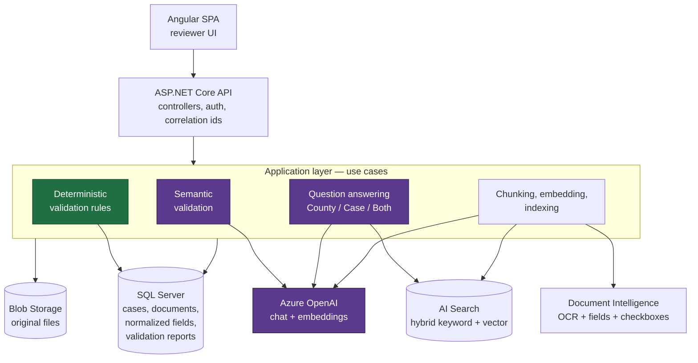

# Harris County AI Document Review Assistant

An internal web application that helps a Harris County reviewer answer one question about a permit
submission: **does what the applicant sent in match what the county actually requires?**

It compares the submitted documents against the county's own published requirements, reports what is
missing or wrong, and answers grounded questions with citations back to the source. The reviewer
always makes the final decision — the system's job is to make the evidence fast to find and easy to
check.

The implemented workflow is the **Harris County Floodplain Development Permit**, filed through the
Residential Development Permit Application pathway. See
[`docs/architecture/initial-workflow.md`](docs/architecture/initial-workflow.md) for the full mapping
from the county's regulations to the rules in code.

---

## Live demo

**<https://agreeable-sea-039f9a40f.7.azurestaticapps.net>**

Sign in as `dev.reviewer` — no password — and open **Ask a Question**. It runs against a search index
holding the real Harris County corpus: 949 chunks across 20 documents, including both versions of the
floodplain regulations, the FEMA Elevation and Floodproofing certificates, and the county's LOMR vs
LOMR-F guidelines.

Questions that answer well, each cited back to a page:

> *How high must the lowest floor of a new house be built in the floodplain?*
> *What is the difference between a LOMR and a LOMR-F?*
> *When is a floodproofing certificate required instead of an elevation certificate?*

And one that should not answer at all:

> *Who won the 2024 World Series?*

It returns **insufficient evidence** rather than an answer, which is the behavior worth checking —
retrieval finds nothing relevant, so no model is asked to be creative about it.

**This is a demo environment, and it is deliberately insecure.** It runs
`Authentication:Mode=LocalDevelopment`, so anyone who can reach the URL can mint an Administrator
token. It holds no real Harris County data and never should. Do not treat it as a reference for how
to deploy this — see [`docs/deployment/dev-environment.md`](docs/deployment/dev-environment.md) for
the Entra ID path.

One known gap: sign in as `dev.admin` and the **Knowledge Base** screen is empty, and no citation has
a source document to open. The corpus was indexed during evaluation work, before this infrastructure
existed, so its chunks live in Azure AI Search while the document records and original PDFs never
made it to the deployed SQL and Blob. Question answering is unaffected — retrieval reads the index,
and each citation carries its own title, section, and page number.

---

## The engineering principle

> **Use deterministic software for deterministic work, retrieval for knowledge, and LLM reasoning
> only when semantic understanding adds value.**

Most "AI document review" products route every question through a model. This one routes each
question to the cheapest mechanism that can answer it correctly:

| The question | Answered by | Why |
|---|---|---|
| Is the signature field signed? Is the date in the future? Is the site plan attached? | **C# validation rules**, no model | The answer is a fact about extracted data. A model can only make it slower, costlier, and non-reproducible. |
| What does Harris County require here? | **Retrieval** over a curated reference corpus | The answer is in a document the county published. Retrieve it and cite it. |
| Does this free-text description actually satisfy the requirement? | **LLM**, with the evidence fenced and labeled | This is a judgment call about meaning. Nothing else can make it. |

Three rules follow from that split, and they are enforced in code rather than asked for in a prompt:

1. **Answers cite their sources.** A citation number the model emits is resolved back to the actual
   retrieved chunk in C#; the model never gets to name its own source.
2. **Insufficient evidence is a valid answer.** When retrieval finds nothing, no model is called at
   all. When the model answers but cites nothing, the answer is *discarded* and replaced with an
   insufficient-evidence response. A confident unsourced answer is a defect, not a feature.
3. **The applicant's documents and the county's corpus never blend.** They are separate scopes at
   retrieval time, separate labeled blocks in the prompt, and separately resolved citations. A
   sentence in an applicant's PDF cannot become "what the county requires."

That last one matters most. The product's central question is meaningless if a submission can be
read as a statement of policy.

---

## Architecture at a glance



Green is deterministic; purple is where a model is involved. The deterministic path never touches
the purple boxes — that is the principle above, drawn.

Two things are deliberately *not* in this diagram because they do not exist: there is no background
worker and no queue. Extraction, ingestion, and validation all run synchronously inside their
request. That is a real limitation at scale and an honest simplification at MVP size.

### Backend layering

Clean Architecture, four projects under `backend/src/`, with the dependency direction enforced by
tests (`HarrisCountyAI.ArchitectureTests`) rather than by convention:

| Project | Responsibility | May depend on |
|---|---|---|
| `HarrisCountyAI.Domain` | Entities, enums, validation primitives | nothing |
| `HarrisCountyAI.Application` | Use cases, service interfaces, orchestration | Domain |
| `HarrisCountyAI.Infrastructure` | EF Core persistence, Azure SDK implementations | Application, Domain |
| `HarrisCountyAI.Api` | Controllers, middleware, HTTP concerns | Application, Infrastructure |

Every external service sits behind an application-owned interface — `IDocumentExtractionService`,
`IRetrievalService`, `ILanguageModelService`, `IEmbeddingService`, `IDocumentIndexService`,
`IDocumentStorageService`. That is what makes the whole pipeline testable without an Azure
subscription, and it is why the test suite runs offline.

Deeper detail: [`docs/architecture/system-overview.md`](docs/architecture/system-overview.md).

---

## What is real, and what is not

This is an MVP built as a portfolio and interview piece. Being precise about that line is more
useful than a feature list.

| | Status |
|---|---|
| Cases, uploads, extraction, normalization, deterministic validation, reports | **Built and tested end to end**, against SQL Server and Azurite in Docker |
| Semantic validation, RAG question answering, dual-source comparison, citation resolution | **Built and tested**, with the model and search services replaced at their interfaces by scripted fakes |
| Auth (local JWT), role policies, prompt-injection defenses, correlation ids, AI telemetry | **Built and tested** |
| Azure AI Search, Document Intelligence, Azure OpenAI, Blob Storage | **Integration code is written and unit-tested with mocked SDK seams.** Only two Azure AI Search tests and three evaluation runs ever call a live service, and they skip unless you opt in |
| The Harris County reference corpus | **Not in this repo, and not seeded by anything here.** No county PDFs are committed and nothing seeds the search index; ingestion is an operator action through the knowledge-base API. The [live demo](#live-demo) has a corpus because one was ingested by hand |
| Evaluation numbers | **Fixture runs only.** Every committed metric comes from synthetic fixtures and says nothing about production quality |
| Azure deployment | **Deployed and running** — see the [live demo](#live-demo). The Bicep and the GitHub Actions workflow have now been executed end to end against real Azure resources. The deployed instance is a demo: insecure auth, no real data |

The honest summary: the *software* is complete and covered by tests, and it now runs on real Azure
against a real corpus; what is still missing is any *measurement of real-world quality*, and a
deployment posture fit for real data. The docs say so everywhere rather than in one buried caveat.

---

## Running it locally

Verified on macOS with .NET SDK 10.0.201 and Node 22.23.2.

### 1. Start the local dependencies

```bash
docker compose up -d
```

That is SQL Server 2022 on `localhost:1433` (`sa` / `LocalDev!Passw0rd`) and Azurite on
`localhost:10000`. Both are development-only credentials and both are in
[`docker-compose.yml`](docker-compose.yml).

### 2. Build and test the backend

```bash
cd backend
dotnet build
dotnet test
```

`dotnet test` needs the containers from step 1 — the integration tests use the real database and the
real blob emulator. It needs no Azure account.

### 3. Build and test the frontend

```bash
cd frontend
npm ci
npm run build
npx ng test --watch=false
```

### 4. Run the API

The API validates its Azure configuration at startup (`ValidateOnStart`) and **refuses to boot with
the empty placeholders that are committed**. This is deliberate — a misconfigured deployment fails
immediately and loudly instead of failing on the first reviewer's question. It does mean you must
supply values before `dotnet run` will start:

```bash
cd backend/src/HarrisCountyAI.Api

DocumentIntelligence__Endpoint=... DocumentIntelligence__ApiKey=... \
LanguageModel__Endpoint=...       LanguageModel__ApiKey=...       LanguageModel__Deployment=... \
Search__Endpoint=...              Search__ApiKey=... \
Embeddings__Endpoint=...          Embeddings__ApiKey=...          Embeddings__Deployment=... \
dotnet run --launch-profile http
```

The two `Deployment` values are the names the deployments were given in the Azure OpenAI resource,
which are **not** the names of the models behind them — a deployment called `chat` may serve
`gpt-5-mini`. Azure routes on the deployment name alone, so naming the model is answered with a 404
on every request. `az cognitiveservices account deployment list -n <resource> -g <group>` lists what
the resource actually has.

`LanguageModel:SupportsTemperature` (`false` by default, since this project runs a reasoning model)
governs whether a temperature is sent at all. Reasoning models — the o-series and GPT-5 — support
only their own default and reject any request that names another.

`LanguageModel:ReasoningTokenReserve` (`2048` by default, for the same reason) is added to whatever
output-token budget a caller asks for. A reasoning model reasons before it writes and charges both
to the same cap, so a budget sized for the answer alone is spent before the answer starts: the
response comes back with a finish reason of `length` and no content, which surfaces as a 502. Set
it to `0` when pointing the app at a model that does not reason. Unused reserve costs nothing —
it is a ceiling, and only tokens actually generated are billed.

The API listens on `http://localhost:5096` (`https://localhost:7074` with the `https` profile),
applies EF Core migrations on startup in Development, and serves Swagger UI at
`http://localhost:5096/swagger`.

Real credentials live outside the repository in `~/.harriscountyai/azure.env`; the committed
`appsettings.json` carries empty-string placeholders only, and nothing in the repo reads a secret
from source control.

Syntactically valid but non-functional endpoints are enough to boot the API and exercise everything
that does not call Azure — cases, uploads, auth, and validation report retrieval all work. A request
that does reach an unreachable Azure service returns a clean `503` problem document naming the
service, not a stack trace:

```json
{ "title": "A required service is temporarily unavailable.", "status": 503, "service": "Embeddings" }
```

### 5. Sign in and use the API

Local development mode issues signed JWTs to anonymous callers from a fixed allow list — two users,
`dev.reviewer` (role `Reviewer`) and `dev.admin` (role `Administrator`), defined in
[`appsettings.Development.json`](backend/src/HarrisCountyAI.Api/appsettings.Development.json).

```bash
TOKEN=$(curl -s -X POST http://localhost:5096/api/auth/dev-token \
  -H 'Content-Type: application/json' -d '{"username":"dev.reviewer"}' \
  | python3 -c 'import json,sys; print(json.load(sys.stdin)["accessToken"])')

curl -s -X POST http://localhost:5096/api/cases \
  -H "Authorization: Bearer $TOKEN" -H 'Content-Type: application/json' \
  -d '{"name":"Creek Bend Development","workflowType":"FloodplainDevelopmentPermit"}'
```

> `Authentication:Mode=LocalDevelopment` hands out valid tokens to anyone who asks. It exists for
> local work only, the `/api/auth/dev-token` route returns `404` in every other mode, and the
> deployment workflow refuses to deploy in this mode unless a run explicitly acknowledges the risk.

The full endpoint reference is [`docs/api/endpoints.md`](docs/api/endpoints.md).

### 6. Run the Angular app

```bash
cd frontend
npm start          # http://localhost:4200
```

The browser at `http://localhost:4200` calls the API at `http://localhost:5096` cross-origin, which
works because the API registers a `LocalDevelopment` CORS policy — **only when it is running in the
Development environment**. The origins it admits come from `Cors:AllowedOrigins` in
`backend/src/HarrisCountyAI.Api/appsettings.Development.json`; serve the UI from a different port and
you add that origin there. The list is the only thing that opens the policy up — there is no wildcard
fallback, so an empty list admits nothing.

Deployed environments never use this policy. There the Static Web App origin is allowed at the App
Service layer by the deployment workflow, exactly as before.

The frontend's own test suite covers the reviewer journey end to end against a mocked HTTP backend
(`frontend/src/app/reviewer-workflow.spec.ts`), so the flow itself is verified — just not through a
real browser.

---

## Tests

The full suite runs offline. Observed on `main` at the time of writing:

| Suite | Result |
|---|---|
| `HarrisCountyAI.UnitTests` | 1190 passed |
| `HarrisCountyAI.IntegrationTests` | 272 passed, 5 skipped |
| `HarrisCountyAI.ArchitectureTests` | 3 passed |
| **Backend total** | **1465 passed, 5 skipped, 0 warnings** |
| Frontend (Vitest, via `ng test`) | 205 passed across 27 files |

The five skips are the opt-in tests that cost money or need a live service: two Azure AI Search
round-trips and the three live evaluation runs (retrieval, generation, judge). They skip by default,
never run in CI, and are the only tests in the repository that would spend an Azure credit.

Running one test class or file:

```bash
cd backend  && dotnet test --filter "FullyQualifiedName~CaseIsolationEndToEndTests"
cd frontend && npx ng test --watch=false
```

CI ([`.github/workflows/ci.yml`](.github/workflows/ci.yml)) runs both suites on every pull request
against `main` and every push to it, standing up SQL Server and Azurite alongside the runner. CI has
no Azure credentials by design, so it can never accidentally spend a credit — which also means a live
regression is caught by a human running the evaluation scripts, not by CI.

---

## Evaluation

Retrieval quality and generation quality are measured separately, because "the answer was wrong" has
two very different causes and one number cannot tell them apart. All three harnesses run offline and
free against committed fixtures, and each has a `--live` mode that costs money:

```bash
evaluation/scripts/run-retrieval-evaluation.sh     # Recall@1/3/5 and MRR, per category
evaluation/scripts/run-generation-evaluation.sh    # outcome match, fact coverage, citation contract
evaluation/scripts/run-judge-evaluation.sh         # LLM-as-a-judge, checked against human labels
```

Datasets: 28 hand-written retrieval questions across four categories, and 18 generation questions of
which 3 are deliberately out-of-scope so that refusal behavior is measured rather than assumed.

**Every committed number is `runType: Fixture`.** Fixture runs replay a synthetic corpus and
hand-written answers through the real pipeline, which makes them excellent regression gates and
worthless as a quality claim. No live baseline exists yet. The methodology, the metrics, and a long
and unflattering list of what the numbers cannot tell you are in
[`docs/evaluation/evaluation-strategy.md`](docs/evaluation/evaluation-strategy.md).

---

## Documentation

| Document | What it covers |
|---|---|
| [`docs/architecture/system-overview.md`](docs/architecture/system-overview.md) | The whole system: layering, the three request flows, where each Azure service is used |
| [`docs/architecture/initial-workflow.md`](docs/architecture/initial-workflow.md) | The floodplain permit workflow, requirement by requirement, mapped to rules |
| [`docs/architecture/rag-architecture.md`](docs/architecture/rag-architecture.md) | Chunking, embedding, the index schema, the corpus separation guarantee, hybrid retrieval, reranking |
| [`docs/architecture/security.md`](docs/architecture/security.md) | Prompt injection, the sanitization boundary, authentication and authorization, upload validation |
| [`docs/architecture/observability.md`](docs/architecture/observability.md) | Correlation ids, structured logging, AI request telemetry, what is never logged |
| [`docs/evaluation/evaluation-strategy.md`](docs/evaluation/evaluation-strategy.md) | How retrieval, generation, and the judge are measured, and what the numbers do not mean |
| [`docs/demo/demo-script.md`](docs/demo/demo-script.md) | A walkthrough of the system with sample questions |
| [`docs/testing/mvp-test-plan.md`](docs/testing/mvp-test-plan.md) | The test strategy and where each Azure dependency is faked |
| [`docs/api/endpoints.md`](docs/api/endpoints.md) | Every HTTP endpoint, its auth policy, and its responses |
| [`docs/deployment/dev-environment.md`](docs/deployment/dev-environment.md) | The deployment runbook and its one-time operator setup |
| [`infra/README.md`](infra/README.md) | The Bicep templates and the Azure resources they create |
| [`PRD.md`](PRD.md) / [`Tasks.md`](Tasks.md) | The original product requirements and the PR-by-PR plan |

### Screenshots

*Not included.* Producing them requires running the UI against a live Azure environment that has
never been provisioned, and a screenshot of a mocked screen would misrepresent what has actually
been demonstrated. The reviewer journey is instead described step by step, with the component and
API call behind each screen, in [`docs/demo/demo-script.md`](docs/demo/demo-script.md).

---

## Required Azure services

| Service | Used for | Dev tier in [`infra/`](infra/README.md) |
|---|---|---|
| Azure AI Search | The chunk index; hybrid keyword + vector retrieval; optional semantic reranking | `free` |
| Azure AI Document Intelligence | OCR, key-value pairs, checkbox selection marks (`prebuilt-layout`) | `F0` |
| Azure OpenAI | Chat completions (`gpt-5-mini`) and embeddings (`text-embedding-3-small`, 1536 dims) | `S0`, two deployments |
| Azure SQL Database | Cases, documents, normalized fields, validation reports | `Basic`, 2 GB |
| Azure Blob Storage | Original uploaded files, in two containers: `case-documents`, `knowledge-base` | `Standard_LRS` |
| Azure App Service (Linux) | Hosts the API | `F1` |
| Azure Static Web Apps | Hosts the Angular app | `Free` |
| Application Insights + Log Analytics | Telemetry, enabled only when a connection string is configured | `PerGB2018` |

Free and near-free tiers throughout, because the whole environment was scoped to fit inside a small
Azure credit. That has consequences worth knowing: the free search tier has no semantic ranker, which
is why reranking ships **off by default and fails open** to plain hybrid ordering.

### Configuration

All settings bind from configuration or environment variables (`Section__Key` in the environment).
Committed values are placeholders.

| Setting | Default | Purpose |
|---|---|---|
| `DocumentIntelligence:Endpoint` / `:ApiKey` | *(required)* | Document Intelligence resource |
| `DocumentIntelligence:ModelId` | `prebuilt-layout` | Extraction model |
| `LanguageModel:Endpoint` / `:ApiKey` | *(required)* | Azure OpenAI chat resource |
| `LanguageModel:Deployment` | *(required)* | Chat deployment name, not the model name |
| `LanguageModel:MaxOutputTokens` | `1024` | Answer budget when a caller names none |
| `LanguageModel:ReasoningTokenReserve` | `2048` | Added to the answer budget to pay for reasoning |
| `Embeddings:Endpoint` / `:ApiKey` | *(required)* | Azure OpenAI embeddings resource |
| `Embeddings:Deployment` | *(required)* | Deployment name; must produce 1536 dimensions |
| `Embeddings:MaxBatchSize` | `16` | Texts per embedding request |
| `Search:Endpoint` / `:ApiKey` | *(required)* | Azure AI Search service |
| `Search:IndexName` | `harris-county-chunks` | The single shared chunk index |
| `Retrieval:Mode` | `Hybrid` | `Hybrid` or `VectorOnly` (for A/B comparison) |
| `Retrieval:DefaultTopK` | `5` | Chunks retrieved when a request does not specify |
| `Reranking:Enabled` | `false` | Semantic reranking; needs a paid search tier |
| `Reranking:CandidatePoolSize` | `20` | Hybrid candidates fed to the reranker |
| `Resilience:MaxRetryAttempts` | `3` | Retry budget handed to the Azure SDK clients |
| `Resilience:NetworkTimeoutSeconds` | `30` | Per-attempt network timeout |
| `Authentication:Mode` | `LocalDevelopment` (dev only) | `LocalDevelopment` or `EntraId` |
| `ConnectionStrings:Database` | *(local dev value)* | SQL Server / Azure SQL |
| `BlobStorage:ConnectionString` | `UseDevelopmentStorage=true` (dev) | Azurite locally, storage account in Azure |
| `BlobStorage:MaxFileSizeBytes` | `52428800` | 50 MB upload cap |
| `ApplicationInsights:ConnectionString` | *(empty)* | Enables App Insights when set |

---

## Known limitations

Listed because a project page that only lists strengths is not worth reading. Each of these is real
and verified against the code, not hypothetical.

**Quality is unmeasured.**

- No live evaluation baseline exists. Every committed metric is a fixture run over a synthetic
  corpus, and says nothing about how the system performs on the real regulations.
- The LLM judge has never been run against a real model, so its agreement with the human labels is
  entirely unmeasured. No judge score should carry weight in a decision yet.
- The reference corpus is not ingested. Until it is, retrieval expectations (section numbers, and
  the page numbers that are all still `null`) are hand-written against the corpus structure rather
  than verified against ingested documents.

**Security and access control.**

- **No per-case ownership.** Any authenticated Reviewer can open any case, its documents, and its
  reports. There is no owner field on the case entity and no resource-based authorization. This is
  asserted by a test that is deliberately named after the gap
  (`Any_Reviewer_Can_Open_Any_Case_Today_Because_Cases_Have_No_Owner`).
- The `EntraId` authentication mode is config-validated and boots, but has never been exercised
  against a real tenant, and the Angular app's only sign-in path is the local dev-token endpoint —
  so an Entra-mode deployment currently has no usable UI.
- Upload validation checks extension, client-declared content type, and size. It does **not** sniff
  file contents, so a renamed file with a spoofed `application/pdf` content type passes. There is no
  malware scanning.
- Prompt text — which contains raw document and chunk content — is logged at `Debug` level by
  `AzureLanguageModelService`. It never appears at `Information`, but no log redaction exists.
- No rate limiting anywhere, including on the endpoints that call a model.

**Operational maturity.**

- The deployment workflow has been run against a single development environment only, and that
  environment runs with insecure demo auth. It requires one-time operator setup (federated identity,
  a GitHub environment, secrets), and the Bicep templates must be deployed first.
- The deployed environment's SQL and Blob hold no knowledge-base records, because its search index
  was populated separately. Bringing them into sync means clearing the index and re-ingesting
  through the API, so all three stores are written by the same operation.
- Extraction, ingestion, and validation are synchronous inside their HTTP request. There is no
  worker, no queue, and no job status beyond the row's own status column.
- Deactivating a knowledge-base document does not remove its chunks from the search index, so a
  deactivated document stays retrievable. Re-ingestion *does* clean up correctly (delete-then-index).
- A knowledge document whose ingestion is interrupted mid-flight stays in `Processing` forever;
  there is no reset path, and a re-ingest attempt returns `409`.
- Retry and timeout are configured on the Azure SDK clients, but there is no circuit breaker or
  bulkhead, and `/health` only reports that the process is up — it never probes SQL, Blob, Search, or
  the model. A dependency that is down still returns `Healthy`.

**Product surface gaps.**

- The backend supports a third question scope, `Both`, which compares the submission against the
  county requirements in one answer — with the two corpora retrieved separately and cited
  separately. The frontend's `QuestionScope` type admits only `County` and `Case`, so this working
  capability has no UI.
- Knowledge-base ingestion is reachable over the API but has no button in the admin screen; upload
  and deactivate do.
- `RequirementComparisonService` — the deterministic-first requirement comparison engine — is
  registered and tested but is not called by any controller.
- `RetrievalDebugController` (`POST /api/debug/retrieval`) is an administrator-only debugging
  endpoint whose own doc comment schedules it for removal now that the question-answering endpoints
  exist. It has not been removed.

---

## Contributing

Branches are `feature/pr-XX-short-name`; pull requests are titled `PR-XX: Description` and describe
the reason for the change, the testing performed, and known limitations. Every pull request includes
tests for the code it changes, and the full build and test suite must pass before it is considered
done. See [`CLAUDE.md`](CLAUDE.md) for the working agreement.
