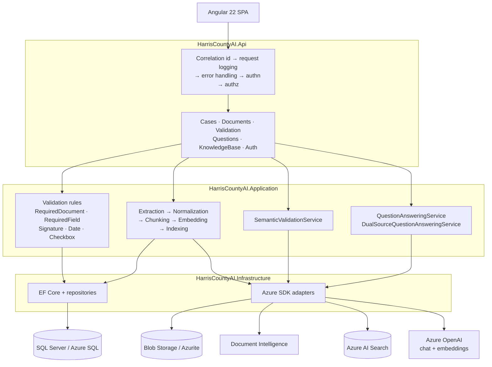
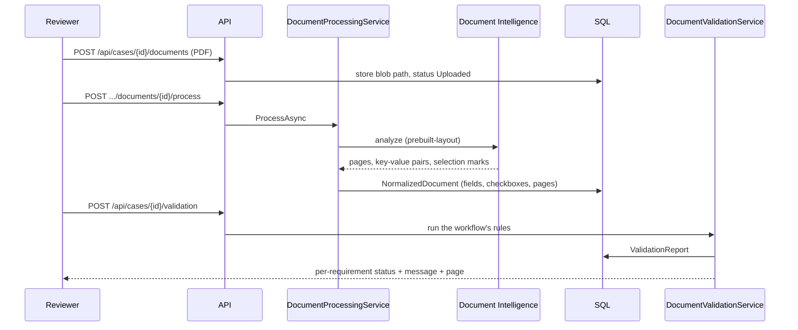
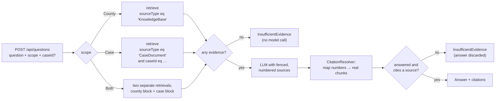

# System Overview

The Harris County AI Document Review Assistant compares what an applicant submitted against what
Harris County requires, and presents findings in a reviewable, auditable format. This document is the
map: what the pieces are, how a request moves through them, and where each decision is made. See
[`PRD.md`](../../PRD.md) for the requirements this was built against, and the
[root README](../../README.md) for how to run it.

## Guiding principle

> Use deterministic software for deterministic work, retrieval for knowledge, and LLM reasoning only
> when semantic understanding adds value.

The whole architecture is a consequence of taking that seriously. Deterministic checks are C# rules
with no model in the call path. Knowledge questions are answered by retrieval and cited. Only genuine
judgment calls reach a model, and even those are gated by deterministic pre-checks that resolve the
easy cases first.

## Components



## Backend layering

A lightweight Clean Architecture split (see `backend/HarrisCountyAI.slnx`):

| Project | Responsibility | May depend on |
|---|---|---|
| `HarrisCountyAI.Domain` | Entities, enums, value objects, validation primitives | nothing |
| `HarrisCountyAI.Application` | Use cases, service interfaces, orchestration | Domain |
| `HarrisCountyAI.Infrastructure` | EF Core persistence, Azure SDK implementations | Application, Domain |
| `HarrisCountyAI.Api` | Controllers, middleware, HTTP concerns | Application, Infrastructure |

These rules are enforced by `HarrisCountyAI.ArchitectureTests`, which fails the build if a layer
gains a forbidden dependency — the boundary is a test, not a comment.

All external AI/Azure services sit behind application-owned interfaces (`IDocumentStorageService`,
`IDocumentExtractionService`, `ILanguageModelService`, `IEmbeddingService`, `IRetrievalService`,
`IDocumentIndexService`, `IRerankingService`) with Azure implementations in Infrastructure. Two
consequences follow, and both are load-bearing for this project: business logic is testable with
fakes, so the entire suite runs with no Azure account; and every external dependency is replaceable
without touching a use case.

## The three request flows

Everything the product does is one of three flows.

### 1. Deterministic validation — no model, ever



The rules that run are the workflow's — for the floodplain permit, three `RequiredDocumentRule`s,
five `RequiredFieldRule`s, a `SignatureRule`, a `DateRule`, and four `CheckboxRule`s. Each produces a
`ValidationStatus` (`Complete`, `Missing`, `Invalid`, `PotentiallyIncomplete`, `NeedsHumanReview`,
`UnableToDetermine`) stamped `ValidationType.Deterministic`. No model is consulted at any point in
this flow, so it is reproducible, free, and fast.

Where the deterministic engine genuinely cannot decide, it says so rather than guessing. The FEMA
Elevation Certificate is required for Class II submissions, but the permit class depends on
flood-zone data the engine does not have — so its absence reports `NeedsHumanReview`, not `Missing`.
The full requirement-by-requirement mapping is in [`initial-workflow.md`](initial-workflow.md).

### 2. Semantic validation — a model, tightly boxed

Two requirements in the floodplain workflow are genuine judgment calls: whether the narrative
description of the work is consistent with the checked construction-type boxes, and whether the
"describe the use" free text is specific enough to be useful. Both run as `SemanticEvaluationRule`
through `ISemanticValidationService`, in a section of the workflow (`BuildSemanticRules()`) kept
visibly separate from the deterministic one (`BuildDeterministicRules()`).

The rule resolves everything it can in code before spending a model call: not applicable → `Complete`
without a call; the document is absent → `UnableToDetermine` without a call; the box is checked but
the description is empty → `Missing` without a call. Only a present, non-trivial piece of text that
actually needs judging reaches the model.

The model returns strict JSON — `pass`, `fail`, or `needs_human_review` with short reasoning — and
**everything else fails closed to `UnableToDetermine`**: a model error, unparseable JSON, a missing
field, an unrecognized verdict. A validator that guessed when it could not read the response would be
worse than no validator.

### 3. Grounded question answering — retrieval, then a model, then citations resolved in code



Three properties are worth calling out because they are enforced rather than requested:

- **No evidence means no model call.** Retrieval returning zero chunks short-circuits to an
  insufficient-evidence response. There is nothing for a model to be grounded in, so it is not asked.
- **The model does not name its own sources.** It emits citation *numbers* into the numbered source
  list it was given; `CitationResolver` maps each number back to the actual retrieved chunk, drops
  anything out of range or duplicated, and stamps the source corpus from the retrieval scope. A
  fabricated citation cannot survive that mapping.
- **An uncited answer is discarded.** If the model answers but cites nothing, the answer text is
  thrown away and replaced with the insufficient-evidence message. In the `Both` scope the rule is
  stricter still: an answer that cites no *county* source is downgraded, because a comparison that
  never referenced a requirement has not compared anything.

Technical failures — a model exception, unparseable output, an unknown status — surface as HTTP `502`
with a problem document, never as a fabricated answer.

## Knowledge domains

The system maintains a strict separation between two knowledge domains:

- **Case evidence** — documents uploaded for a specific application. Retrieval is always filtered by
  `sourceType eq 'CaseDocument'` *and* `caseId`.
- **County evidence** — the curated Harris County reference corpus, filtered by
  `sourceType eq 'KnowledgeBase'`.

Content from one must never contaminate the other's retrieval results, and in the comparison flow the
two occupy separately labeled blocks in the prompt with separately resolved citations. How that is
guaranteed at the index and query level is in [`rag-architecture.md`](rag-architecture.md).

Both domains are untrusted input as far as the model is concerned: applicants author the documents in
one, and administrators ingest the other from external sources. See [`security.md`](security.md) for
how uploaded documents and retrieved passages are isolated from the instruction channel.

## Execution model

Everything is synchronous and request-scoped. There is no background worker, no hosted service, and
no queue anywhere in the codebase:

| Work | Runs inside |
|---|---|
| Extraction, normalization, and case-document indexing | `POST /api/cases/{caseId}/documents/{documentId}/process` |
| Knowledge-base ingestion (extract → chunk → embed → index) | `POST /api/knowledge-base/documents/{id}/ingest` |
| Validation, including any semantic rules | `POST /api/cases/{caseId}/validation` |

This is a deliberate MVP simplification, not an oversight: a queue would add infrastructure,
at-least-once semantics, and a job-status API to a system that has not yet demonstrated its core
value. It is also a real scaling limit — a large multi-page PDF holds an HTTP request open for the
whole extraction — and it is listed as such in the README's known limitations.

Two related design choices sit alongside it. Case-document indexing **fails open**: if the search
index cannot be updated, the failure is logged and the document is still successfully extracted,
normalized, and validated, because deterministic validation does not depend on the index. And
processing is idempotent by re-run — indexing is delete-then-index by `documentId`, so reprocessing a
document never leaves duplicate or stale chunks behind.

## Resilience and failure handling

Retry and timeout are configured once, in `Resilience` configuration, and handed to the Azure SDK
clients' own retry pipelines rather than wrapped in a second layer — the SDKs already retry
`408`/`429`/`5xx` and honor `Retry-After`, and stacking a policy on top multiplies the effective
attempt count invisibly.

`AzureOperationExecutor` is the translation seam: Azure `RequestFailedException`s (which carry
endpoints and request URIs) never escape Infrastructure. They become
`ExternalServiceTimeoutException` or `ExternalServiceUnavailableException`, which the API renders as
a `503` problem document naming the service and stating that other features are unaffected.

There is no circuit breaker and no bulkhead, and `/health` reports only that the process is running —
it does not probe SQL, Blob, Search, or the model. Because the Azure options classes use
`ValidateOnStart`, a *misconfigured* dependency prevents the API from booting at all; a dependency
that is configured but down still reports `Healthy`.

## Local development

```bash
docker compose up -d      # SQL Server (localhost:1433) + Azurite blob emulator (localhost:10000)

cd backend  && dotnet build && dotnet test
cd frontend && npm ci && npm run build && npx ng test --watch=false
```

The full test suite runs against the real database and the real blob emulator, with Document
Intelligence, Azure OpenAI, and Azure AI Search replaced at their interfaces by scripted fakes — see
[`../testing/mvp-test-plan.md`](../testing/mvp-test-plan.md) for which seam each one is replaced at.
No Azure account is needed.

Running the API itself does need Azure configuration present, because the Azure options are validated
at startup; the [root README](../../README.md#4-run-the-api) has the exact command.
